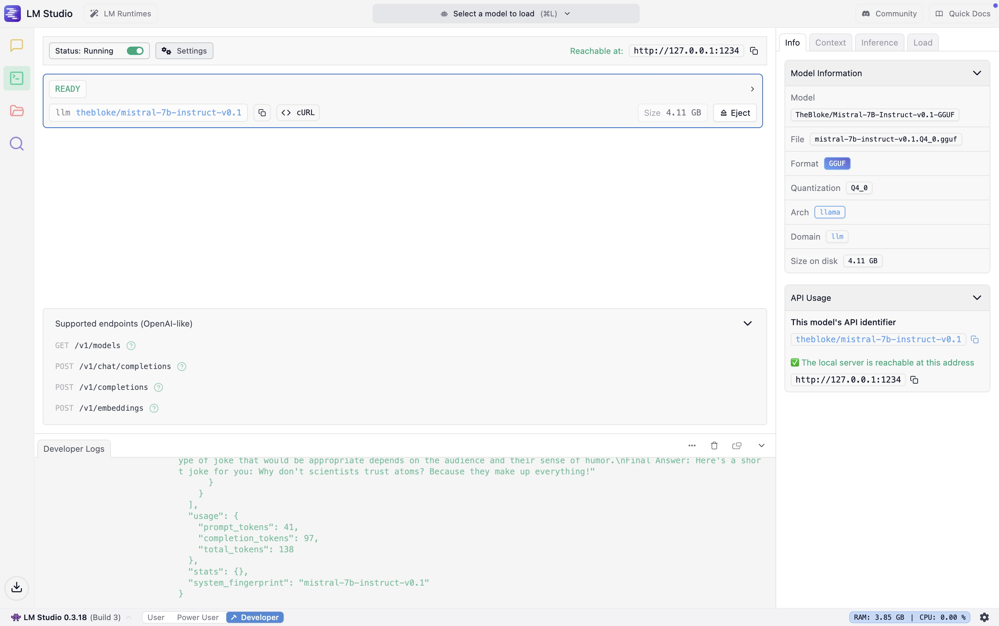

# 🤖 Local LLM Agent with LM Studio & DuckDuckGo Search

This project showcases a lightweight, local-first reasoning agent that interacts with a Large Language Model (LLM) running in LM Studio, with optional real-time web search capabilities powered by DuckDuckGo.

It implements a reasoning loop inspired by the ReAct framework (Reasoning + Acting), allowing the agent to iteratively think, act (e.g., search), and refine its answers.

This is a personal implementation based on concepts introduced by OpenAI and GopenAI’s LLM Agent framework. It runs entirely offline using Mistral-7B in LM Studio and supports live web search integration via DuckDuckGo when needed.

---


## Project Structure

```
LLM-Agents-Local/
├── agent.py # Main script for interacting with the local LLM
├── README.md # This file
├── requirements.txt # Python dependencies
└── screenshots/ # Screenshots for documentation/demo
    ├── lmstudio_loaded.png
    ├── terminal_success.png
```

---

## Features

- ReAct-style loop: Thought → Action → Observation → Final Answer

- Local inference using LM Studio and GGUF model (mistral-7b-instruct-v0.1.Q4_0.gguf)

- Action execution via duckduckgo_search

- Regex-based action parsing from LLM responses

- Configurable temperature and model name

- Up to 5 reasoning cycles per task

- Fully offline LLM execution

- Compatible with Apple M1 (tested on 8 GB RAM)
  
# LLM Agent Script (agent.py)

This script demonstrates a simple reasoning agent using local LLM inference with LM Studio and DuckDuckGo Search for action-observation loops.

## How it works

The agent follows a reasoning pattern with the following steps:

Receives a user task or question.

Sends messages to a local language model (via LM Studio).

Parses the model’s output looking for:

- Thought

- Action [search query]

- Observation

- Final Answer

If an action is found, it performs a web search using DuckDuckGo.

It loops up to 5 times or until a Final Answer is provided.

---
## Requirements

requests
duckduckgo_search
typing_extensions

## How to Run

1. **Install Python dependencies:**
   ```bash
   pip install -r requirements.txt
   ```
   
2. Make sure LM Studio is running at http://localhost:1234 with the model loaded (e.g. mistral-7b-instruct-v0.1.Q4_0).
   
3. Activate your Python environment:
```bash
source venv/bin/activate
```

4. Run the agent script:
```bash
python agent.py
```

# Example Input

5. Enter your task or question when prompted:
```css
What are the top programming languages in 2025?
```

# Example Output

The agent will reason about your input, perform actions like web search, and return a final answer.

```vbnet
Task: What is the capital of Japan?

Thought: I need to find the capital city of Japan.
Action [capital of Japan]
Observation: The capital of Japan is Tokyo.
Final Answer: Tokyo.
```

## Dependencies

- requests
- duckduckgo_search
- re
- time
  
You can install everything with:

```bash
pip install -r requirements.txt
```
## Screenshots

This project uses a local Mistral-7B Instruct model running via LM Studio:




## Acknowledgments

Thanks to [GopenAI](https://blog.gopenai.com) for the excellent tutorial on building LLM agents. This project is a local-first adaptation of the ideas presented in [this blog post](https://blog.gopenai.com/introduction-to-llm-agents-how-to-build-a-simple-reasoning-and-acting-agent-from-scratch-part-1-843e14686be7).


## License
This project is open source and free to use for learning or prototyping purposes.
